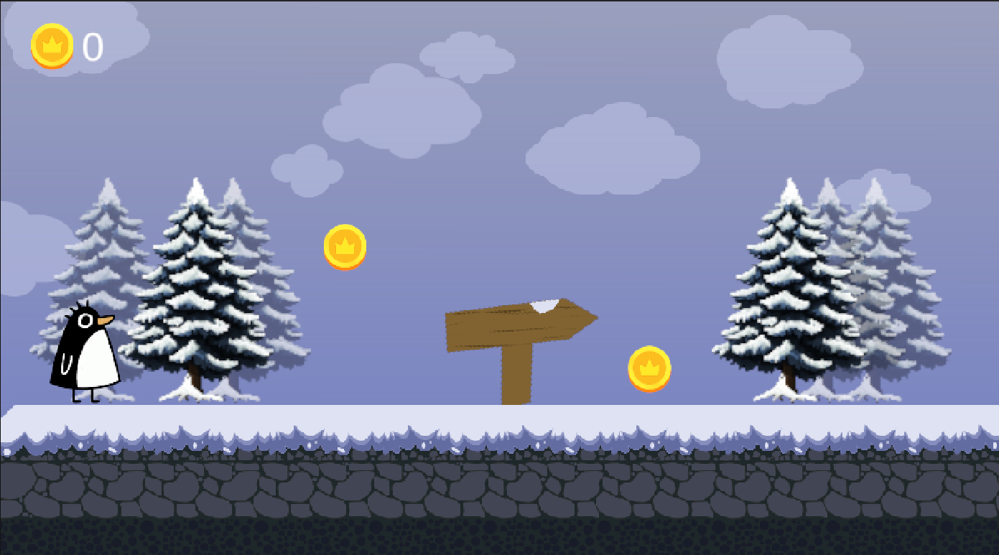

# 🐧 Juego de Plataforma 2D

 

>Este es un juego de plataformas 2D protagonizado por un simpático pingüino que debe recorrer paisajes nevados recolectando monedas y superando obstáculos.

## 📷 Captura de Pantalla

 

## 🎮 Descripción

Controla a un pingüino a través de un mundo nevado, salta plataformas, recolecta monedas doradas y supera los desafíos del bosque invernal. Con gráficos simpáticos y una ambientación relajante, este juego es perfecto para todos los públicos.

 

## 🚀 Características

- ❄️ Escenario invernal con árboles nevados
  
- 🐧 Protagonista carismático (pingüino)
- 🪙 Monedas coleccionables con icono de corona
- 🎵 Música de fondo y efectos sonoros para juegos casuales
- 📌 Señales direccionales que guían el camino
- 🎨 Animaciones suaves y tilesets bien definidos

 

## 🕹️ Controles

* ⬅️ o (A) / ➡️ o (D): Moverse a la izquierda/derecha

* Barra espaciadora: Saltar

 

## 🛠️ Tecnologías utilizadas

- 🔧 Motor: **Unity 6 (6000.0.36f1)**
- 💻 Lenguaje: **C#**
- 🎮 Editor: `Unity Hub`
- 📁 Sistema de escenas: `MainScene.unity`

 

## 📁 Créditos de Assets

Este juego utiliza recursos de la Unity Asset Store y otros paquetes gratuitos:

- 🎶 [**FREE Casual Game SFX Pack**](https://assetstore.unity.com/packages/audio/sound-fx/free-casual-game-sfx-pack-54116)
- 🎶 [**Casual Game BGM #5**](https://assetstore.unity.com/packages/audio/music/casual-game-bgm-5-135943)
- 🌲 [**Pixel Art Spruce Tree Pack**](https://assetstore.unity.com/packages/2d/pixel-art-spruce-tree-pack-snow-edition-animated-271287)
- 🧊 [**plataforms 2D, Lovely Snowy**](https://assetstore.unity.com/packages/2d/environments/2d-platformer-lovely-snowy-292417)
- 🐧 [**2D Character Sprite Animation - Penguin**](https://assetstore.unity.com/packages/2d/characters/2d-character-sprite-animation-penguin-236747)

Gracias a todos los creadores por sus valiosos aportes a la comunidad.

 

## 🗺️ Próximas mejoras

- [ ] Sistema de daño y vidas

- [ ] Enemigos y obstáculos

- [ ] Niveles adicionales

 

## 👨‍💻 Autor

Desarrollado por Alexandra Olivares como proyecto personal.